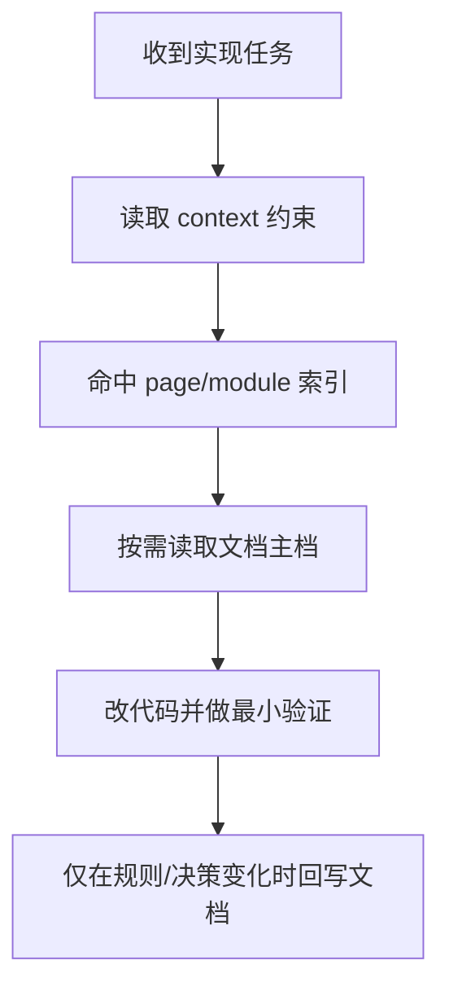

# AI 上下文治理 - 业务规则

## 业务流程

## 主真相

1. 实现任务遵循“按需扩读”，禁止全量扫描 docs。
2. 冲突优先级统一为 `代码 > docs`，冲突先与用户确认。
3. memory 仅作为辅助检索，不再作为强制流程。
4. 页面目录划分按 `page-views` 规则执行，按需建目录，禁止空壳。

## 非目标

- 不改业务代码逻辑。
- 不强制迁移旧目录结构之外的业务文档。

## 迁移来源

- `.aimin-skill/doc/设计/ai-context-aimin-skills-refresh.md`
- `.aimin-skill/doc/设计/ai-rules-page-views-module-split.md`
