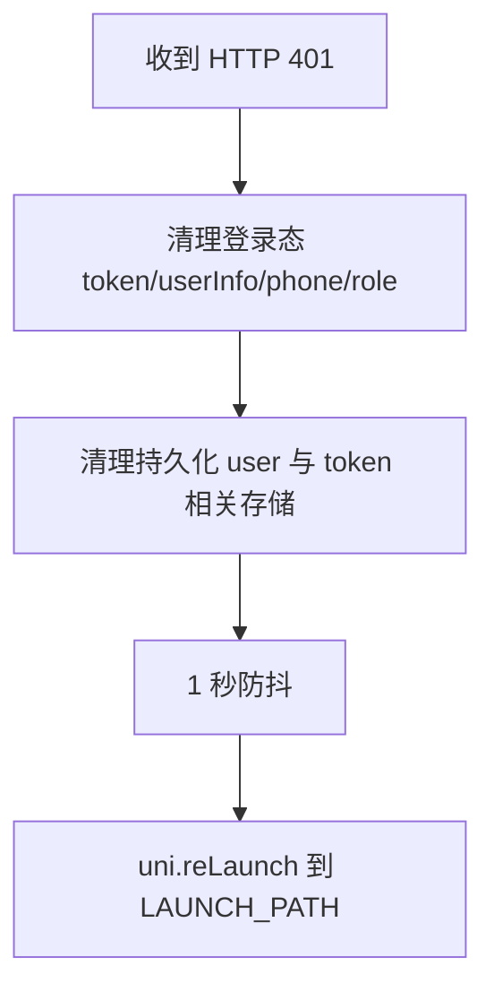

# HTTP 401 未授权处理 - 业务规则

## 业务流程

## 主真相

1. 接口返回 `HTTP 401` 时统一清理本地登录态。
2. 必须兜底删除 key 名包含 `token` 的存储项，避免残留。
3. 必须触发重新登录流程。
4. 并发防抖窗口为 1 秒，防止并发请求重复跳转。

## 非目标

- 不引入 refresh token 机制。
- 不改业务错误码（`data.code`）处理逻辑。

## 迁移来源

- `.aimin-skill/doc/设计/http-401-token-重登.md`
