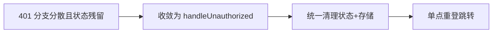

# HTTP 401 未授权处理 - 设计决策

## 决策流程

## 决策记录

1. 在 `src/http/index.ts` 内集中实现 `handleUnauthorized()`，避免各接口层重复实现。
2. 401 处理只对 HTTP 状态码生效，不侵入业务码分支，降低联动风险。
3. 增加短时防抖，避免并发请求触发多次 `reLaunch`。

## 代码落点

- `src/http/index.ts`

## 迁移来源

- `.aimin-skill/doc/设计/http-401-token-重登.md`
