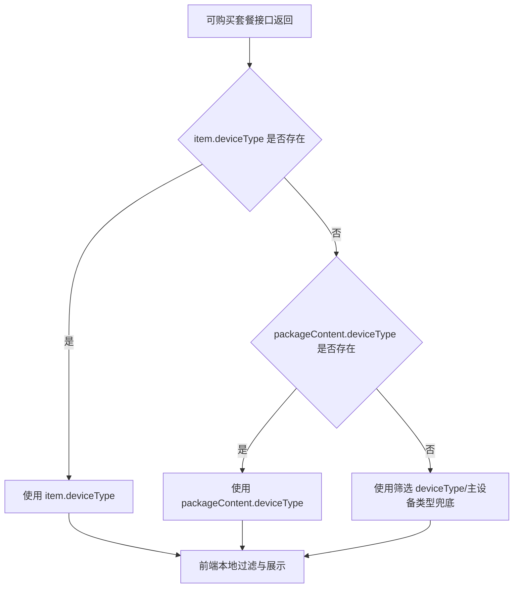

# 套餐可购买设备类型补齐 - 业务规则

## 业务流程

## 主真相

1. `available` 列表进入页面后必须先归一化设备类型再参与展示/筛选。
2. 套餐卡片类型判断必须优先使用套餐自身设备类型，不依赖当前学生主设备类型。
3. 筛选“全部”时，`available` 查询不传 `deviceType`。
4. 其他依赖设备类型的接口（生效中/待生效、待支付、待审核）继续回退主设备类型，禁止透传 `'ALL'`。
5. `available` 接口请求参数仅透传 `page/pageSize`，设备类型由前端本地过滤保障行为稳定。

## 非目标

- 不修改后端接口定义。
- 不改变套餐购买业务流程。

## 迁移来源

- `.aimin-skill/doc/设计/package-list-available-device-type-assemble.md`
