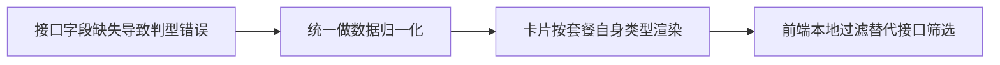

# 套餐可购买设备类型补齐 - 设计决策

## 决策流程

## 决策记录

1. 把设备类型归一化放在页面入口链路，避免组件重复兜底。
2. 把 `isValidDeviceType` 等判断逻辑抽离到 `utils`，降低重复实现。
3. 通过 `hooks/useAvailablePackages.ts` 承载可购买列表状态，减少 `index.vue` 业务细节。
4. 对 OpenAPI 变更采取“请求简化 + 前端本地过滤”的兼容策略，优先保证历史筛选行为不回归。

## 代码落点

- `src/pages-sub/package/list/utils/availablePackage.ts`
- `src/pages-sub/package/list/hooks/useAvailablePackages.ts`
- `src/pages-sub/package/list/components/PackageCard.vue`
- `src/api/interface/modules/package.ts`
- `src/api/modules/package/query.ts`

## 迁移来源

- `.aimin-skill/doc/设计/package-list-available-device-type-assemble.md`
- `.aimin-skill/doc/设计/package-list-page-structure-split.md`
