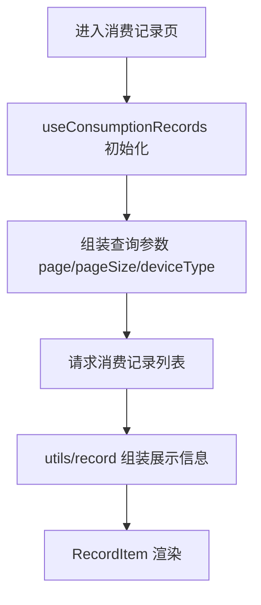

# 消费记录页面

## 页面路径

- `src/pages-sub/history/consumption/index.vue`

## 页面流程

## 业务规则

1. 页面入口 `index.vue` 仅保留页面编排与流程调度。
2. 页面复用类型下沉到 `types.ts`，避免重复声明。
3. 页面逻辑下沉到 `hooks/` 与 `utils/`，按需建目录，不保留空壳。
4. 清理未使用历史模拟文件，避免误导维护者。
5. 消费类型文案中 `DRYER` 统一为“吹风机”。

## 代码落点

- `src/pages-sub/history/consumption/hooks/useConsumptionRecords.ts`
- `src/pages-sub/history/consumption/types.ts`
- `src/pages-sub/history/consumption/utils/record.ts`
- `src/pages-sub/history/consumption/constants.ts`
- `src/pages-sub/history/consumption/index.vue`
- `src/pages-sub/history/consumption/components/RecordItem.vue`
- `src/constant/modules/business/device/service.ts`

## 非目标

- 不改消费记录接口字段定义。
- 不改筛选逻辑与列表交互行为。

## 迁移来源

- `.aimin-skill/doc/设计/消费记录页面结构拆分.md`
