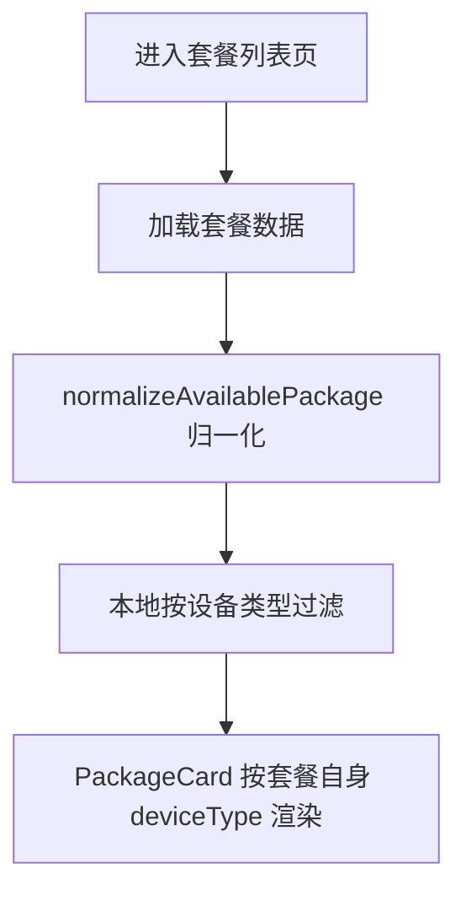

# 套餐列表页面

## 页面路径

- `src/pages-sub/package/list/index.vue`

## 页面流程

## 业务规则

1. 页面入口 `index.vue` 只保留页面编排与流程调度。
2. 页面状态常量下沉到 `constants.ts`，页面类型下沉到 `types.ts`。
3. 可购买套餐归一化逻辑下沉到 `utils/availablePackage.ts`。
4. 可购买列表状态与兜底设备类型管理下沉到 `hooks/useAvailablePackages.ts`。
5. 筛选项必须包含“全部”；选中“全部”时 `available` 查询不传 `deviceType`。
6. 可购买套餐 `deviceType` 缺失时按“接口值 -> packageContent -> 当前筛选 -> 主设备类型”兜底。

## 代码落点

- `src/pages-sub/package/list/index.vue`
- `src/pages-sub/package/list/constants.ts`
- `src/pages-sub/package/list/types.ts`
- `src/pages-sub/package/list/hooks/useAvailablePackages.ts`
- `src/pages-sub/package/list/utils/availablePackage.ts`
- `src/pages-sub/package/list/components/PackageCard.vue`
- `src/api/interface/modules/package.ts`
- `src/api/modules/package/query.ts`

## 非目标

- 不改套餐购买主流程。
- 不改后端接口路径与认证方式。

## 关联模块

- `../modules/package-available-device-type/business.md`
- `../modules/package-available-device-type/decisions.md`

## 迁移来源

- `.aimin-skill/doc/设计/package-list-page-structure-split.md`
- `.aimin-skill/doc/设计/package-list-available-device-type-assemble.md`
