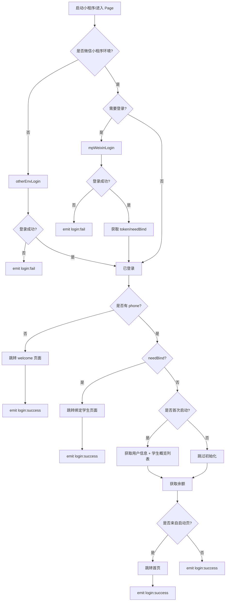

```mermaid
flowchart TD
  A[启动小程序/进入 Page] --> B{是否微信小程序环境?}

  B -->|否| C[otherEnvLogin]
  C --> C1{登录成功?}
  C1 -->|否| C2[emit login:fail]
  C1 -->|是| N[已登录]

  B -->|是| K{需要登录?}
  K -->|是| L[mpWeixinLogin]
  L --> L1{登录成功?}
  L1 -->|否| L2[emit login:fail]
  L1 -->|是| M[获取 token/needBind]
  M --> N
  K -->|否| N

  N --> O{是否有 phone?}
  O -->|否| P[跳转 welcome 页面]
  P --> P1[emit login:success]
  O -->|是| Q{needBind?}
  Q -->|是| R[跳转绑定学生页面]
  R --> R1[emit login:success]
  Q -->|否| S{是否首次启动?}
  S -->|是| S1[获取用户信息 + 学生概览列表]
  S -->|否| S2[跳过初始化]
  S1 --> S3[获取余额]
  S2 --> S3
  S3 --> T{是否来自启动页?}
  T -->|是| U[跳转首页]
  U --> U1[emit login:success]
  T -->|否| V[emit login:success]
```

说明：
- 登录失败时立即 emit login:fail。
- 进入已登录分支后，无论跳转到 welcome/绑定/首页或停留当前页，都会 emit login:success。
- 首次启动时才会请求用户信息与学生概览列表，后续页面进入会跳过该初始化流程。
